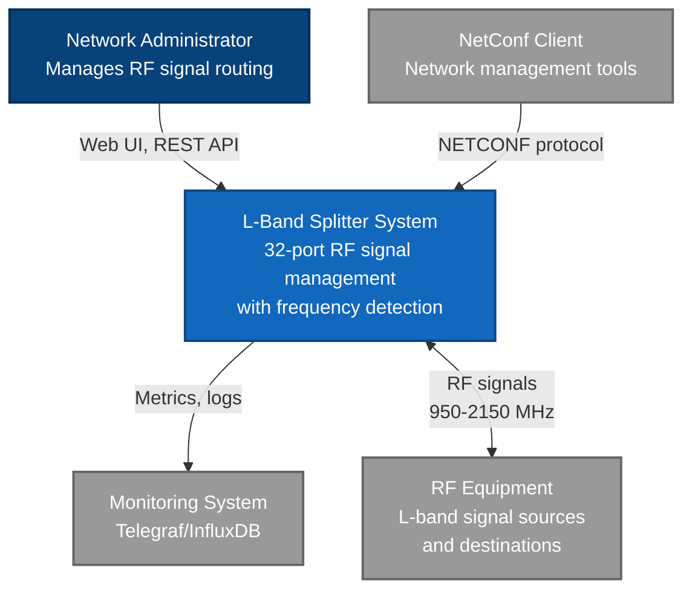
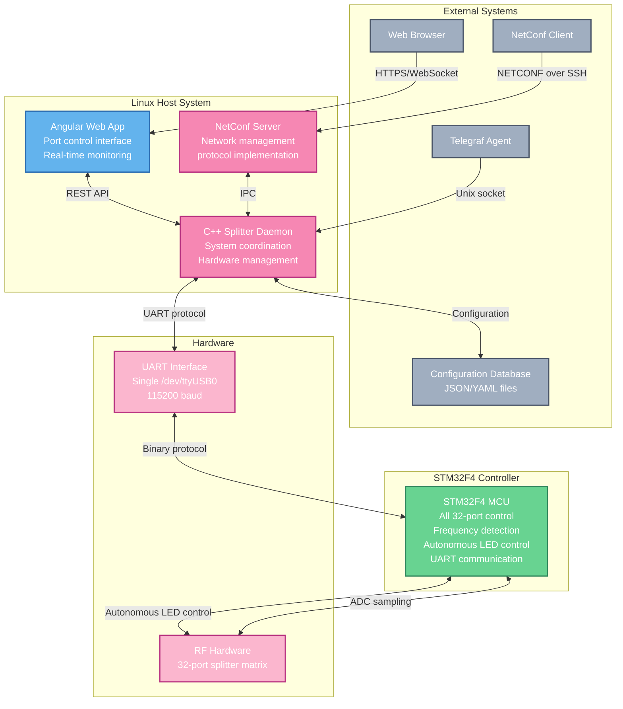
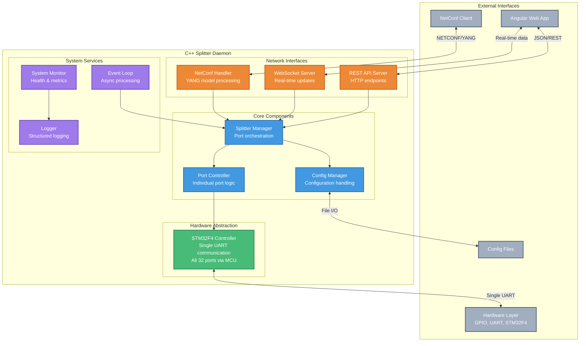
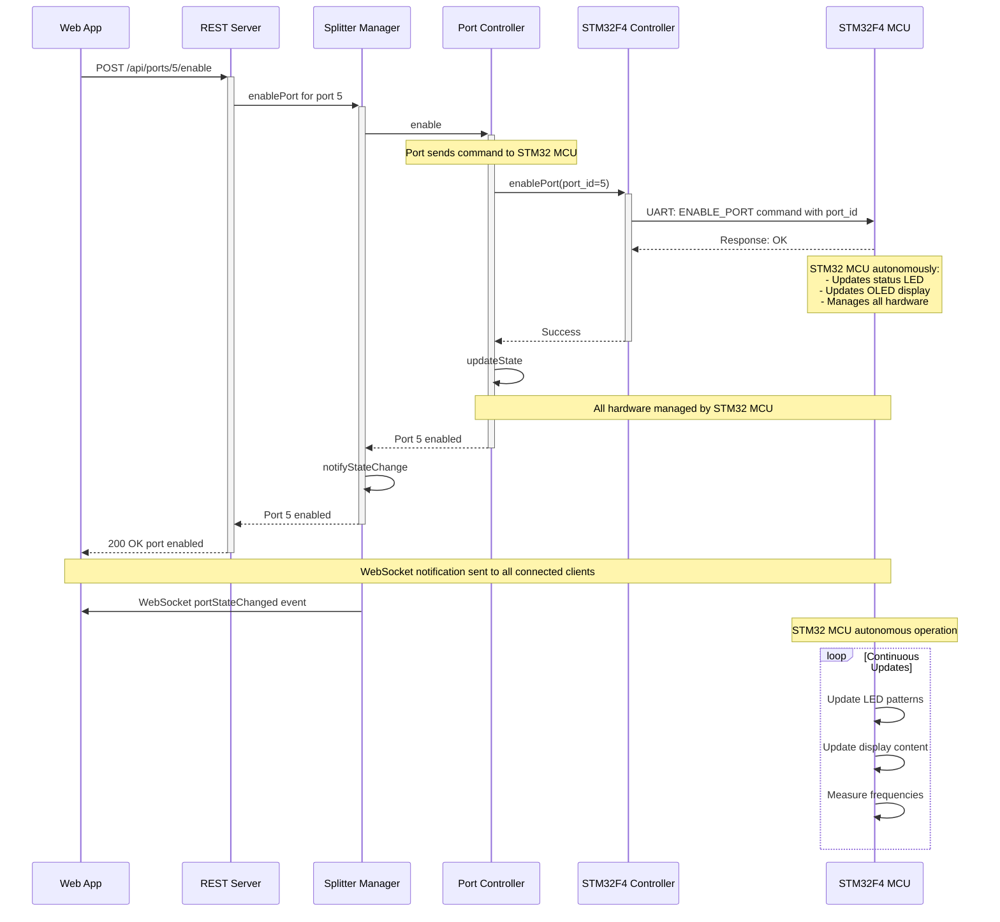
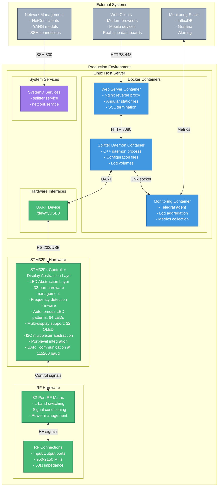

# L-Band Splitter/Combiner System

A 32-port L-band RF signal splitter/combiner system with hardware control, frequency detection, and web-based management interface.

## System Overview

This system provides:
- **32-port L-band signal control** (950-2150 MHz)
- **Single STM32 MCU** handling all hardware autonomously
- **STM32F4 frequency detection** with FFT-based signal analysis
- **Real-time frequency detection** via UART communication to single STM32 MCU
- **Web-based control interface** (Angular frontend)
- **NetConf protocol support** for network management
- **System monitoring** with Telegraf integration

## Architecture

The system follows a centralized architecture with a single STM32F4 microcontroller handling frequency detection and autonomous LED control for all 32 ports, while a Linux daemon manages overall system coordination and port configuration.

### C4 Context Diagram



### C4 Container Diagram



### C4 Component Diagram - Splitter Daemon



### C4 Dynamic Diagram - Port Enable Sequence



### C4 Deployment Diagram



## Build Requirements

### Dependencies

#### Host System (C++ Daemon)
- **C++17 compiler** (GCC 8+ or Clang 10+)
- **CMake 3.15+**
- **Conan 2.0+** package manager
- **Node.js 18+** and npm (for web interface)

#### STM32F4 Firmware (Optional)
- **gcc-arm-none-eabi** cross-compilation toolchain
- **STM32CubeF4** HAL library (for full firmware build)
- **OpenOCD** or **ST-LINK** utilities (for flashing firmware)

### Supported Platforms
- **Linux** (primary target with GPIO hardware support)
- **macOS** (development/testing - hardware interfaces mocked)

## Build Instructions

### 1. Install Conan Dependencies

```bash
# Install C++ dependencies
conan install . --build=missing
```

### 2. Build C++ Daemon

```bash
# Configure build (Release)
cmake --preset conan-release

# Build daemon and tests
cmake --build --preset conan-release
```

For debug builds:
```bash
# Configure and build debug version
conan install . --build=missing --settings=build_type=Debug
cmake --preset conan-debug
cmake --build --preset conan-debug
```

### 3. Run Unit Tests

```bash
# Run tests from build directory
cd build/Release
ctest --verbose
```

### 4. Build STM32F4 Firmware (Optional)

```bash
# Build firmware for STM32F4 microcontrollers
cmake --build --preset conan-release --target stm32f4_firmware

# Flash to STM32F4 device (requires ST-LINK or OpenOCD)
cd build/Release/firmware/stm32f4
make flash  # or make flash_openocd
```

**Requirements:**
- ARM cross-compilation toolchain (`gcc-arm-none-eabi`)
- STM32CubeF4 HAL library (set `STM32_HAL_PATH` environment variable)
- CMSIS library (optional, set `CMSIS_PATH` environment variable)

**Installation on Ubuntu/Debian:**
```bash
sudo apt install gcc-arm-none-eabi
# Download STM32CubeF4 from ST website and extract to /opt/STM32CubeF4/
```

**Installation on macOS:**
```bash
brew install armmbed/formulae/gcc-arm-none-eabi
```

### 5. Build Web Interface

```bash
# Install Node.js dependencies
cd webapp && npm install

# Development server
npm run dev

# Production build
npm run build
```

## Running the System

### C++ Daemon

```bash
# Run with default configuration
./build/Release/src/splitter_daemon

# Run with custom config file
./build/Release/src/splitter_daemon /path/to/config.yaml
```

**Note**: On macOS, the daemon will fail to initialize GPIO hardware (expected behavior). On Linux with proper GPIO hardware, it will control the 32-port system.

### Web Interface

```bash
cd webapp
npm run dev
# Opens web interface at http://localhost:4200
```

## Project Structure

```
├── src/                    # C++ source code
│   ├── core/              # Core splitter management
│   ├── hardware/          # Hardware abstraction (STM32F4 communication only)
│   ├── firmware/stm32f4/  # STM32F4 frequency detector firmware
│   │   ├── display_abstraction.c/h  # Display hardware abstraction layer
│   │   ├── led_abstraction.c/h      # LED hardware abstraction layer
│   │   ├── port.c/h                 # Port management using abstractions
│   │   ├── secure_boot.c/h          # Secure boot implementation
│   │   ├── bootloader_main.c        # Secure bootloader
│   │   └── abstraction_example.c    # Usage examples
│   ├── netconf/           # NetConf protocol implementation
│   ├── web/               # REST/WebSocket API servers
│   └── utils/             # Logging and system monitoring
├── webapp/                # Angular web interface
├── tests/                 # Unit and integration tests
├── config/                # Configuration files and YANG models
├── scripts/               # Build and deployment scripts
│   ├── firmware_sign.py   # Ed25519 firmware signing utility
│   ├── firmware_verify.py # Firmware verification utility
│   └── README.md          # Firmware utilities documentation
├── docs/                  # System documentation
│   └── secure_boot.md     # Secure boot system documentation
└── docker/                # Docker configuration
```

## Hardware Requirements

### Host System
- **1 UART interface** for STM32F4 communication (`/dev/ttyUSB0`)
- **Serial communication** at 115200 baud
- **No GPIO requirements** - STM32 MCU handles all hardware autonomously
- **No I2C requirements** - STM32 MCU manages all displays and multiplexers

### STM32F4 Microcontroller (1 unit)
- **STM32F407VG** or compatible (168 MHz, 1MB Flash, 192KB RAM)
- **Hardware Abstraction Layers**: Display and LED abstractions for clean hardware management
- **Display Abstraction**: Supports multiple display types (SSD1306 OLED, HD44780 LCD, 7-segment)
- **LED Abstraction**: Advanced pattern generation (blink, pulse, flash) with GPIO and PWM support
- **64+ GPIO pins** for autonomous LED control via abstraction layer (2 per port × 32 ports)
- **32 individual OLED displays** (SSD1306, 128x64 pixels, I2C interface)
- **I2C multiplexer network** (TCA9548A) for display addressing via display abstraction
- **12-bit ADC channels** for L-band signal sampling (multiplexed across ports)
- **Timer peripherals** for LED pattern timing and measurement intervals
- **UART interface** for host communication (115200 baud)
- **I2C master interface** managed by display abstraction
- **Port-level hardware integration** via Port abstraction using display and LED layers

### RF Hardware
- **32 L-band ports** with switching matrices
- **RF frontend circuits** for signal conditioning (950-2150 MHz)
- **ADC input stages** connected to STM32F4 microcontrollers
- **Power management** for active components

## Configuration

### System Configuration
Create `/etc/splitter/config.yaml`:

```yaml
system:
  name: "L-Band Splitter"
  ports: 32

network:
  rest_host: "127.0.0.1"
  rest_port: 8080
  netconf_host: "0.0.0.0"
  netconf_port: 830
  enable_ssl: false

logging:
  level: "info"
  file: "/var/log/splitter/daemon.log"
  max_size_mb: 100
  max_files: 10

monitoring:
  metrics_interval_seconds: 30
  enable_health_endpoint: true
```

## Development

### Code Style
- Modern C++17 with RAII and smart pointers
- Thread-safe design with proper mutex usage
- Hardware abstraction for testability
- Structured logging with spdlog

### Dependencies Used
- **spdlog**: Structured logging
- **nlohmann_json**: JSON configuration parsing
- **Google Test/Mock**: Unit testing framework

### Disabled Components (macOS Build)
The following components are disabled in macOS builds due to dependency unavailability:
- NetConf server (requires libnetconf2)
- REST/WebSocket servers (requires cpprest)
- Some unit tests (require hardware mocks)

## Deployment

### System Service (Linux)

```bash
# Install as systemd service
sudo cmake --install build/Release --prefix /usr/local
sudo systemctl enable splitter
sudo systemctl start splitter
```

### Docker Deployment

```bash
# Build and start all services
scripts/docker/build.sh
scripts/docker/deploy.sh start

# View logs
scripts/docker/deploy.sh logs --follow
```

## Monitoring

The system integrates with Telegraf for metrics collection:
- Port status and frequency readings
- System health monitoring  
- Hardware error tracking

## License

See project documentation for licensing information.

## Development Status

**✅ Successfully Built and Tested**
- Core daemon compiles and runs
- STM32F4 frequency detector firmware implemented and tested
- Logger system functional
- Hardware abstraction working (GPIO, UART, STM32F4)
- Build system (CMake + Conan) operational with ARM cross-compilation
- Comprehensive unit tests passing
- CI/CD pipeline includes firmware compilation

**✅ STM32F4 Firmware Features**
- L-band frequency detection (950-2150 MHz) with 1 kHz resolution
- FFT-based signal analysis with 256-point processing
- SNR calculation and signal quality assessment
- UART communication protocol compatible with host system
- Real-time ADC sampling with 12-bit resolution
- Power management with sleep modes

## Threat Model

### Overview

This threat model analyzes security risks for the L-band splitter/combiner system, identifying potential attack vectors, vulnerabilities, and mitigation strategies. The system operates in critical RF infrastructure environments where security, availability, and integrity are paramount.

### System Assets

**Critical Assets:**
- **RF Signal Integrity**: 32-port L-band signal routing (950-2150 MHz)
- **Hardware Control**: STM32F4 microcontroller and GPIO interfaces
- **System Configuration**: Port settings, frequency detection parameters
- **Operational Data**: Real-time measurements, system health metrics
- **Network Access**: Web interface, REST API, NetConf protocol

**Supporting Assets:**
- System logs and audit trails
- Firmware binaries and configuration data
- Network credentials and certificates
- Physical hardware components

### Threat Actors

**External Threats:**
- **Malicious Operators**: Unauthorized network administrators
- **Remote Attackers**: Internet-based threat actors
- **RF Interference Actors**: Intentional signal jamming/spoofing
- **Supply Chain Attackers**: Compromised components or firmware

**Internal Threats:**
- **Malicious Insiders**: Authorized personnel with malicious intent
- **Negligent Users**: Accidental misconfigurations or exposures
- **Compromised Accounts**: Legitimate accounts under attacker control

**Physical Threats:**
- **Physical Access**: Unauthorized hardware tampering
- **Environmental**: Power/cooling failures, EMI interference

### Attack Vectors & Threat Analysis

#### 1. Network-Based Attacks

**Threat: Unauthorized Web Interface Access**
- **Vector**: Direct HTTP/HTTPS access to Angular web application
- **Impact**: Full system control, configuration changes, service disruption
- **Likelihood**: High (if network exposed)
- **Mitigations**: 
  - Implement strong authentication (multi-factor preferred)
  - Use HTTPS with proper certificate validation
  - Network segmentation and firewall rules
  - Rate limiting and intrusion detection
  - Regular security updates

**Threat: REST API Exploitation**
- **Vector**: Direct API calls bypassing web interface
- **Impact**: Unauthorized port control, configuration tampering
- **Likelihood**: Medium
- **Mitigations**:
  - API authentication and authorization
  - Input validation and sanitization
  - API rate limiting and monitoring
  - Secure API design (OWASP guidelines)

**Threat: NetConf Protocol Attacks**
- **Vector**: SSH-based NetConf protocol exploitation
- **Impact**: Network management compromise, bulk configuration changes
- **Likelihood**: Medium
- **Mitigations**:
  - Strong SSH key management
  - NetConf session validation
  - YANG model constraints
  - Network access controls

#### 2. Hardware Interface Attacks

**Threat: UART Communication Interception**
- **Vector**: Physical access to STM32F4 UART interfaces
- **Impact**: Command injection, firmware manipulation, sensor spoofing
- **Likelihood**: Low (requires physical access)
- **Mitigations**:
  - Physical enclosure security
  - UART protocol encryption/authentication
  - Debug interface disabling in production
  - Hardware tamper detection

**Threat: GPIO Manipulation**
- **Vector**: Direct hardware access to GPIO pins
- **Impact**: Unauthorized port control, LED/display manipulation
- **Likelihood**: Low (requires physical access)
- **Mitigations**:
  - Secure enclosures with tamper detection
  - GPIO pin access controls
  - Hardware monitoring and alerting

**Threat: I2C Bus Attacks**
- **Vector**: Physical access to I2C multiplexer and display buses
- **Impact**: Display content manipulation, sensor data corruption
- **Likelihood**: Low (requires specialized access)
- **Mitigations**:
  - Physical security measures
  - I2C bus monitoring
  - Display content validation

#### 3. Firmware and Software Attacks

**Threat: STM32F4 Firmware Compromise**
- **Vector**: Malicious firmware updates or flash memory corruption
- **Impact**: Complete hardware control compromise, persistent backdoors
- **Likelihood**: Medium
- **Mitigations**:
  - Secure boot implementation
  - Firmware signing and verification
  - Read-out protection (RDP) enabled
  - Firmware integrity checking
  - Secure firmware update process

**Threat: Host Software Vulnerabilities**
- **Vector**: Buffer overflows, injection attacks, memory corruption
- **Impact**: System compromise, privilege escalation
- **Likelihood**: Medium
- **Mitigations**:
  - Secure coding practices (RAII, smart pointers)
  - Input validation and sanitization
  - Memory safety tools (AddressSanitizer, Valgrind)
  - Regular security audits and updates
  - Compiler security features (-fstack-protector, ASLR)

#### 4. RF Signal Attacks

**Threat: RF Signal Injection/Jamming**
- **Vector**: Malicious RF signals in L-band spectrum (950-2150 MHz)
- **Impact**: Signal detection disruption, false readings, system instability
- **Likelihood**: Low (requires RF equipment and proximity)
- **Mitigations**:
  - RF shielding and filtering
  - Signal validation and anomaly detection
  - Frequency hopping or spread spectrum techniques
  - Physical security around RF interfaces

**Threat: Side-Channel Analysis**
- **Vector**: Power analysis, electromagnetic emissions analysis
- **Impact**: Cryptographic key recovery, sensitive data extraction
- **Likelihood**: Low (requires sophisticated equipment)
- **Mitigations**:
  - EMI shielding and filtering
  - Power supply stabilization
  - Cryptographic countermeasures
  - Physical security measures

#### 5. Supply Chain and Maintenance Attacks

**Threat: Compromised Components**
- **Vector**: Malicious hardware or firmware in supply chain
- **Impact**: Persistent backdoors, data exfiltration
- **Likelihood**: Low
- **Mitigations**:
  - Trusted supplier verification
  - Component authentication
  - Hardware security testing
  - Supply chain security controls

**Threat: Malicious Updates**
- **Vector**: Compromised software/firmware updates
- **Impact**: System compromise via legitimate update channels
- **Likelihood**: Low
- **Mitigations**:
  - Update signing and verification
  - Secure update channels (HTTPS, signed packages)
  - Update integrity validation
  - Rollback capabilities

### Risk Assessment Matrix

| Threat Category | Likelihood | Impact | Risk Level | Priority |
|-----------------|------------|--------|------------|----------|
| Web Interface Attacks | High | High | **Critical** | P1 |
| REST API Exploitation | Medium | High | **High** | P1 |
| Firmware Compromise | Medium | High | **High** | P1 |
| NetConf Attacks | Medium | Medium | **Medium** | P2 |
| Software Vulnerabilities | Medium | Medium | **Medium** | P2 |
| UART Interception | Low | High | **Medium** | P2 |
| RF Signal Attacks | Low | Medium | **Low** | P3 |
| Hardware Tampering | Low | Medium | **Low** | P3 |
| Supply Chain Attacks | Low | High | **Low** | P3 |

### Security Controls and Mitigations

#### Network Security
- **Authentication**: Multi-factor authentication for web interface
- **Encryption**: HTTPS/TLS for all network communications
- **Network Segmentation**: Isolate system on dedicated network segments
- **Firewall Rules**: Restrictive ingress/egress filtering
- **Intrusion Detection**: Network traffic monitoring and alerting

#### Application Security
- **Input Validation**: Comprehensive validation of all user inputs
- **API Security**: Authentication, rate limiting, input sanitization
- **Session Management**: Secure session tokens and timeout policies
- **Security Headers**: HSTS, CSP, X-Frame-Options implementation
- **Regular Updates**: Timely security patches and dependency updates

#### Hardware Security
- **Physical Security**: Locked enclosures with tamper detection
- **Secure Boot**: STM32F4 secure boot implementation
- **Debug Protection**: Production firmware with debug interfaces disabled
- **RDP Protection**: STM32F4 read-out protection enabled
- **Hardware Monitoring**: GPIO, UART, I2C bus monitoring

#### Operational Security
- **Logging and Monitoring**: Comprehensive audit logging
- **Incident Response**: Defined procedures for security incidents
- **Access Controls**: Principle of least privilege
- **Regular Audits**: Periodic security assessments
- **Backup and Recovery**: Secure configuration backups

#### Development Security
- **Secure Coding**: RAII, memory safety, input validation
- **Code Review**: Mandatory security-focused code reviews
- **Static Analysis**: Automated vulnerability scanning (cppcheck)
- **Testing**: Security test cases and fuzzing
- **CI/CD Security**: Secure build pipeline with integrity checks

### Implementation Recommendations

#### Immediate (P1)
1. **Web Interface Security**:
   - Implement HTTPS with strong cipher suites
   - Add multi-factor authentication
   - Deploy Web Application Firewall (WAF)

2. **API Security**:
   - Add API authentication tokens
   - Implement rate limiting
   - Add comprehensive input validation

3. **Firmware Security**:
   - Enable STM32F4 read-out protection (RDP Level 1)
   - Implement secure boot verification
   - Disable debug interfaces in production builds

#### Short-term (P2)
1. **Network Security**:
   - Deploy network segmentation
   - Configure intrusion detection system
   - Implement network access controls

2. **Monitoring and Logging**:
   - Enhanced security event logging
   - Centralized log management
   - Automated anomaly detection

#### Long-term (P3)
1. **Advanced Security**:
   - Hardware Security Module (HSM) integration
   - RF signal authentication mechanisms
   - Advanced persistent threat (APT) detection

2. **Compliance and Certification**:
   - Security certification (Common Criteria, FIPS)
   - Compliance with industry standards
   - Regular penetration testing

### Conclusion

This threat model identifies significant security risks in network interfaces and firmware security, requiring immediate attention to web interface authentication and API security. The autonomous hardware design provides inherent security benefits by reducing attack surface through eliminated display control channels. Regular review and updates of this threat model are recommended as the system evolves and new threats emerge.

**Ready for Linux hardware deployment** with STM32F4 microcontrollers and RF frontend.