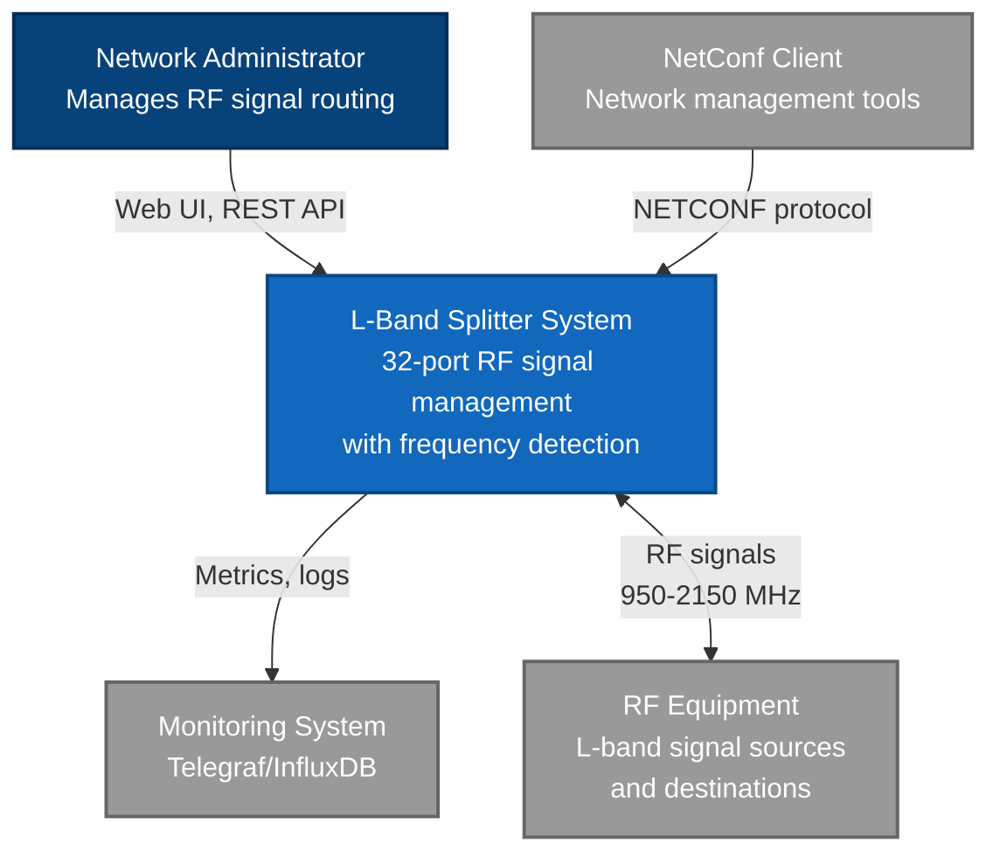
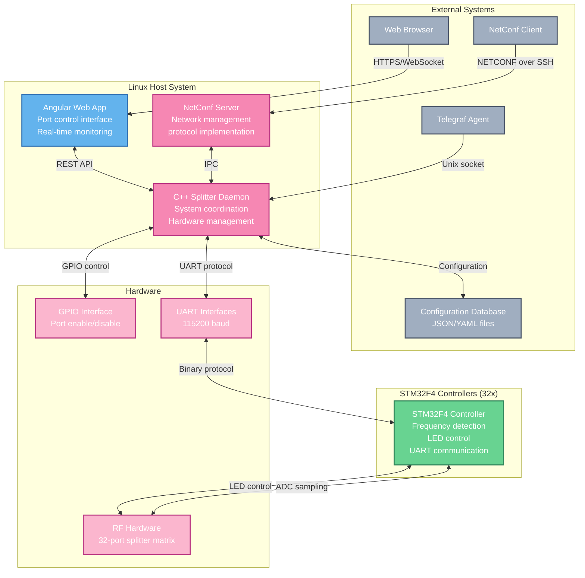
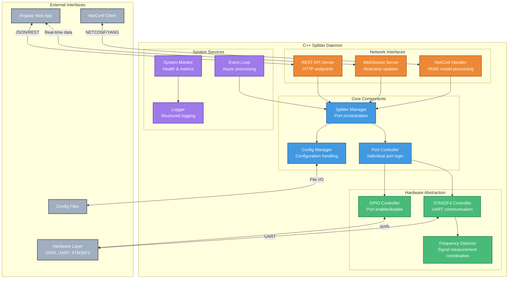
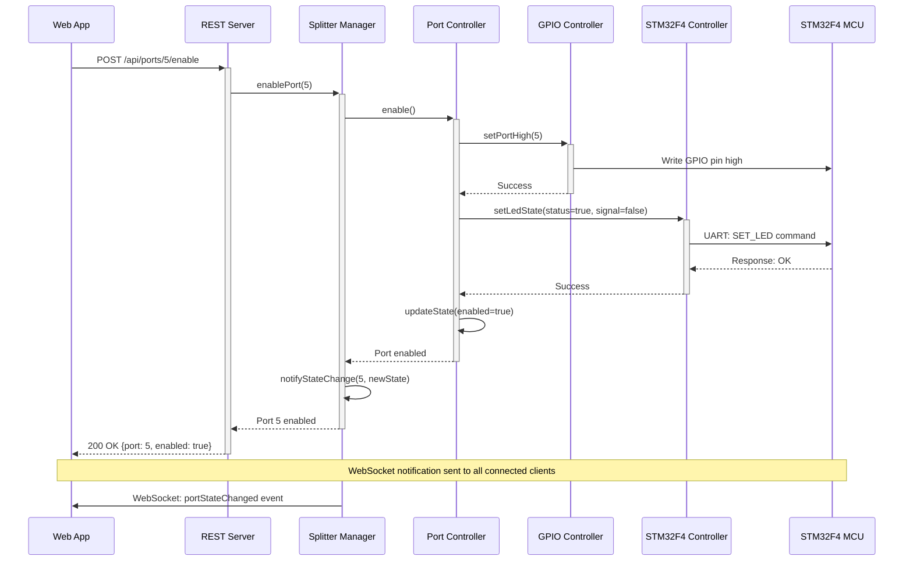
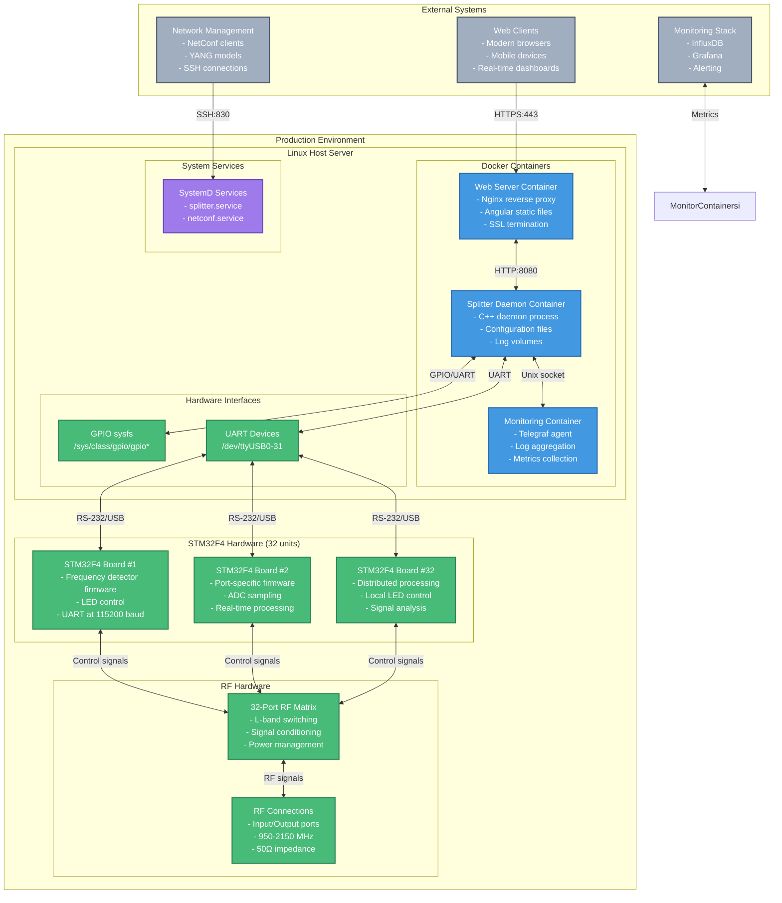

# L-Band Splitter/Combiner System

A 32-port L-band RF signal splitter/combiner system with hardware control, frequency detection, and web-based management interface.

## System Overview

This system provides:
- **32-port L-band signal control** (950-2150 MHz)
- **GPIO-based port enable/disable** with LED status indicators
- **STM32F4 frequency detection** with FFT-based signal analysis
- **Real-time frequency detection** via UART communication to STM32F4 MCUs
- **Web-based control interface** (Angular frontend)
- **NetConf protocol support** for network management
- **System monitoring** with Telegraf integration

## Architecture

The system follows a distributed architecture with multiple STM32F4 microcontrollers handling frequency detection and LED control for each port, while a central Linux daemon manages overall system coordination.

### C4 Context Diagram



### C4 Container Diagram



### C4 Component Diagram - Splitter Daemon



### C4 Dynamic Diagram - Port Enable Sequence



### C4 Deployment Diagram



## Build Requirements

### Dependencies

#### Host System (C++ Daemon)
- **C++17 compiler** (GCC 8+ or Clang 10+)
- **CMake 3.15+**
- **Conan 2.0+** package manager
- **Node.js 18+** and npm (for web interface)

#### STM32F4 Firmware (Optional)
- **gcc-arm-none-eabi** cross-compilation toolchain
- **STM32CubeF4** HAL library (for full firmware build)
- **OpenOCD** or **ST-LINK** utilities (for flashing firmware)

### Supported Platforms
- **Linux** (primary target with GPIO hardware support)
- **macOS** (development/testing - hardware interfaces mocked)

## Build Instructions

### 1. Install Conan Dependencies

```bash
# Install C++ dependencies
conan install . --build=missing
```

### 2. Build C++ Daemon

```bash
# Configure build (Release)
cmake --preset conan-release

# Build daemon and tests
cmake --build --preset conan-release
```

For debug builds:
```bash
# Configure and build debug version
conan install . --build=missing --settings=build_type=Debug
cmake --preset conan-debug
cmake --build --preset conan-debug
```

### 3. Run Unit Tests

```bash
# Run tests from build directory
cd build/Release
ctest --verbose
```

### 4. Build STM32F4 Firmware (Optional)

```bash
# Build firmware for STM32F4 microcontrollers
cmake --build --preset conan-release --target stm32f4_firmware

# Flash to STM32F4 device (requires ST-LINK or OpenOCD)
cd build/Release/firmware/stm32f4
make flash  # or make flash_openocd
```

**Requirements:**
- ARM cross-compilation toolchain (`gcc-arm-none-eabi`)
- STM32CubeF4 HAL library (set `STM32_HAL_PATH` environment variable)
- CMSIS library (optional, set `CMSIS_PATH` environment variable)

**Installation on Ubuntu/Debian:**
```bash
sudo apt install gcc-arm-none-eabi
# Download STM32CubeF4 from ST website and extract to /opt/STM32CubeF4/
```

**Installation on macOS:**
```bash
brew install armmbed/formulae/gcc-arm-none-eabi
```

### 5. Build Web Interface

```bash
# Install Node.js dependencies
cd webapp && npm install

# Development server
npm run dev

# Production build
npm run build
```

## Running the System

### C++ Daemon

```bash
# Run with default configuration
./build/Release/src/splitter_daemon

# Run with custom config file
./build/Release/src/splitter_daemon /path/to/config.yaml
```

**Note**: On macOS, the daemon will fail to initialize GPIO hardware (expected behavior). On Linux with proper GPIO hardware, it will control the 32-port system.

### Web Interface

```bash
cd webapp
npm run dev
# Opens web interface at http://localhost:4200
```

## Project Structure

```
├── src/                    # C++ source code
│   ├── core/              # Core splitter management
│   ├── hardware/          # Hardware abstraction (GPIO, SPI, I2C, STM32F4)
│   ├── firmware/stm32f4/  # STM32F4 frequency detector firmware
│   ├── netconf/           # NetConf protocol implementation
│   ├── web/               # REST/WebSocket API servers
│   └── utils/             # Logging and system monitoring
├── webapp/                # Angular web interface
├── tests/                 # Unit and integration tests
├── config/                # Configuration files and YANG models
├── scripts/               # Build and deployment scripts
└── docker/                # Docker configuration
```

## Hardware Requirements

### Host System
- **32 GPIO pins** for port enable control (1 per port × 32 ports)
- **32 UART interfaces** for STM32F4 communication (one per port)
- **Linux sysfs GPIO interface** (`/sys/class/gpio`)
- **Serial communication** at 115200 baud
- **STM32F4 controllers handle LED control directly** (reduces host GPIO requirements)

### STM32F4 Microcontrollers (32 units)
- **STM32F407VG** or compatible (168 MHz, 1MB Flash, 192KB RAM)
- **12-bit ADC** for L-band signal sampling
- **Timer peripherals** for periodic measurements
- **UART interface** for host communication (115200 baud)
- **GPIO pins** for LED control and RF switching

### RF Hardware
- **32 L-band ports** with switching matrices
- **RF frontend circuits** for signal conditioning (950-2150 MHz)
- **ADC input stages** connected to STM32F4 microcontrollers
- **Power management** for active components

## Configuration

### System Configuration
Create `/etc/splitter/config.yaml`:

```yaml
system:
  name: "L-Band Splitter"
  ports: 32

network:
  web_port: 8080
  netconf_port: 830

hardware:
  gpio_base: "/sys/class/gpio"
  spi_device: "/dev/spidev0.0"
  i2c_device: "/dev/i2c-1"

logging:
  level: "info"
  file: "/var/log/splitter/daemon.log"
  max_size_mb: 100
  max_files: 10
```

## Development

### Code Style
- Modern C++17 with RAII and smart pointers
- Thread-safe design with proper mutex usage
- Hardware abstraction for testability
- Structured logging with spdlog

### Dependencies Used
- **spdlog**: Structured logging
- **nlohmann_json**: JSON configuration parsing
- **Google Test/Mock**: Unit testing framework

### Disabled Components (macOS Build)
The following components are disabled in macOS builds due to dependency unavailability:
- NetConf server (requires libnetconf2)
- REST/WebSocket servers (requires cpprest)
- Some unit tests (require hardware mocks)

## Deployment

### System Service (Linux)

```bash
# Install as systemd service
sudo cmake --install build/Release --prefix /usr/local
sudo systemctl enable splitter
sudo systemctl start splitter
```

### Docker Deployment

```bash
# Build and start all services
scripts/docker/build.sh
scripts/docker/deploy.sh start

# View logs
scripts/docker/deploy.sh logs --follow
```

## Monitoring

The system integrates with Telegraf for metrics collection:
- Port status and frequency readings
- System health monitoring  
- Hardware error tracking

## License

See project documentation for licensing information.

## Development Status

**✅ Successfully Built and Tested**
- Core daemon compiles and runs
- STM32F4 frequency detector firmware implemented and tested
- Logger system functional
- Hardware abstraction working (GPIO, UART, STM32F4)
- Build system (CMake + Conan) operational with ARM cross-compilation
- Comprehensive unit tests passing
- CI/CD pipeline includes firmware compilation

**✅ STM32F4 Firmware Features**
- L-band frequency detection (950-2150 MHz) with 1 kHz resolution
- FFT-based signal analysis with 256-point processing
- SNR calculation and signal quality assessment
- UART communication protocol compatible with host system
- Real-time ADC sampling with 12-bit resolution
- Power management with sleep modes

**Ready for Linux hardware deployment** with STM32F4 microcontrollers and RF frontend.