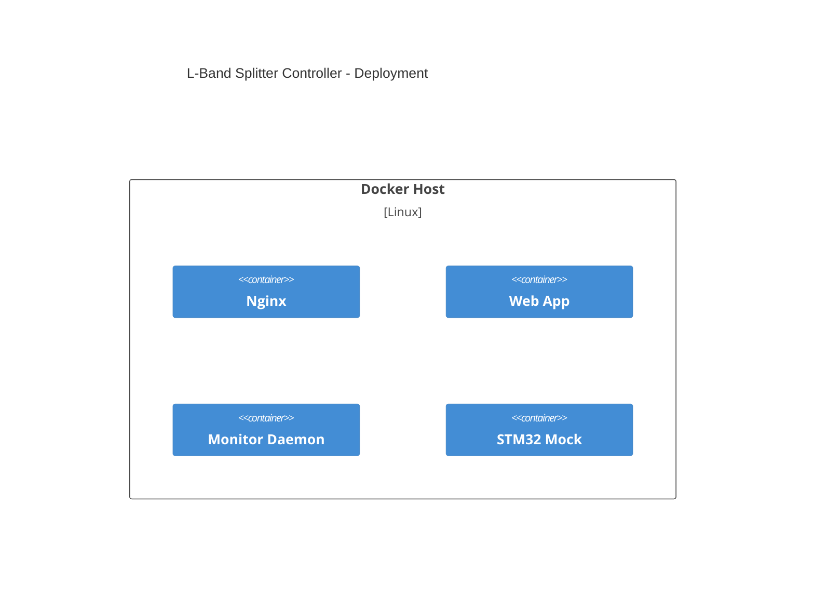

# L-Band Splitter Controller

This directory contains sample C++ code and an Angular component stub for a 32-port L-band splitter/combiner.

The C++ demo computes the center frequency of a synthetic signal using an FFT and stores the result in a `PortState` object.

## Prerequisites

The project uses Conan to provide the required third-party packages such as
Protobuf and Boost.  Install Conan (``pip install conan`` if needed) and let it
detect your host profile:

```
conan profile detect --force
```

## Build and run

Build with the provided `Makefile` to automatically install dependencies and
configure CMake:

```
make build
./build/splitter
```

To run the individual steps manually:

```
conan install . --output-folder build --build=missing
cmake -S . -B build -DCMAKE_TOOLCHAIN_FILE=build/conan_toolchain.cmake
cmake --build build
```

If `cmake` complains about a missing `conan_toolchain.cmake`, ensure the
`conan install` step completed successfully before invoking it.

Run unit tests with CTest:

```
make test
```

Additional handy targets include:

```
make configure  # install dependencies and generate the build system
make run        # build and execute the demo
make clean      # remove the build directory
```

The Angular component (`web/port-status.component.*`) illustrates how a frontend might interact with the backend.

An example Nginx configuration in `web/nginx.conf` shows how to serve the
compiled Angular assets while terminating TLS and proxying `/ws` WebSocket
requests to the daemon running on port 9002.

## Docker Compose

A `docker-compose.yml` file orchestrates the web server, monitor daemon, frontend webapp, and an STM32 mock. Build and launch the stack with:

```
docker compose up --build
```

The nginx service serves the UI on port 8080 while proxying WebSocket traffic to the daemon on port 9002. The development webapp runs on port 4200, and the STM32 mock container is available for integration tests.
It continuously prints simulated port status changes to its logs, making it easy to observe MCU behavior.

### STM32 mock RPC

The STM32 mock also exposes a simple protobuf-based RPC stream on port `50051`.
Build the mock and a tiny client locally with CMake:

```
cmake -S src/stm32 -B build_stm32
cmake --build build_stm32
```

Run the mock and connect with the generated client to watch status updates:

```
./build_stm32/stm32_status_mock &
./build_stm32/stm32_client
```

Each reported status change includes the port number, whether it is enabled,
the center frequency in MHz, and whether a signal is present.

## Dev Container

For a fully configured development environment, this repository includes a
VS Code [Dev Container](https://containers.dev/). Reopen the folder in the
container via the Dev Containers extension and all required tools—Conan,
CMake, and Node—will be available so the provided `Makefile` targets work
out of the box.

## STM32 microcontroller implementation

An embedded variant places the FFT and monitoring on an STM32 MCU using the CMSIS-DSP library. Example code in `src/stm32/fft_monitor.cpp` computes the center frequency of a sample buffer and sends the result over UART.

The embedded build forbids C++ exceptions. A standalone CMake project in `src/stm32` builds the MCU code and compiles with `-fno-exceptions`.

## Protobuf protocol and daemon

A lightweight protocol defined in `proto/splitter.proto` allows the microcontroller to send FFT reports or receive commands such as start/stop and enabling or disabling individual ports. Each envelope includes a CRC32 checksum for basic integrity checking. A simple daemon (`monitor_daemon`) parses these protobuf messages on the Linux SBC, verifies the checksum, and prints the results. The daemon also launches a WebSocket server for communication with the Angular frontend and exposes a NETCONF interface for external control and monitoring, enabling remote clients to toggle ports and query their detected center frequencies.

## Architecture

### Context

```mermaid
C4Context
    title L-Band Splitter Controller - Context
    Person(operator, "Operator")
    System(system, "L-Band Splitter Control System", "Manages splitter ports and includes STM32")
    operator -> system : uses
```

### Container

```mermaid
C4Container
    title L-Band Splitter Controller - Containers
    Person(operator, "Operator")
    System_Boundary(system, "L-Band Splitter Control System") {
        Container(webapp, "Web App", "Angular", "Browser UI")
        Container(nginx, "Nginx", "Web Server", "Serves UI and proxies WebSocket")
        Container(daemon, "Monitor Daemon", "C++", "Processes protobuf and exposes APIs")
        Container(stm32, "STM32 Microcontroller", "C++", "Streams port status")
    }
    operator -> webapp : uses
    webapp -> nginx : HTTP
    nginx -> daemon : WebSocket
    daemon -> stm32 : TCP protobuf
```

### Component (Monitor Daemon)

```mermaid
C4Component
    title Monitor Daemon Components
    Container_Boundary(daemon, "Monitor Daemon") {
        Component(proto, "Protobuf Handler", "Parses and validates messages")
        Component(ws, "WebSocket Server", "Pushes updates to clients")
        Component(netconf, "NETCONF Agent", "Configuration and telemetry")
    }
    proto -> ws : broadcasts status
    proto -> netconf : exposes state
```

### Deployment



