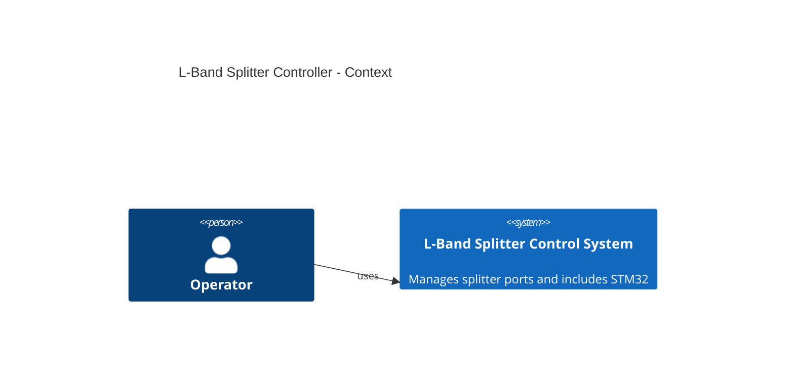
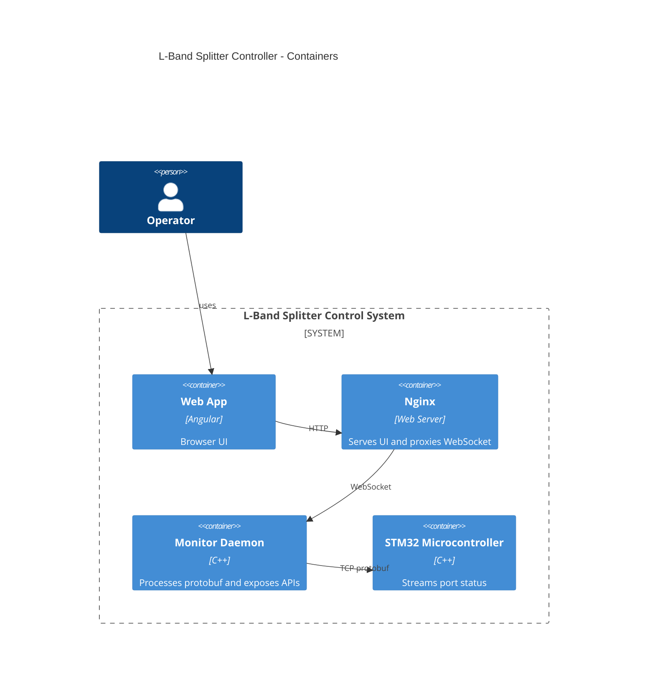
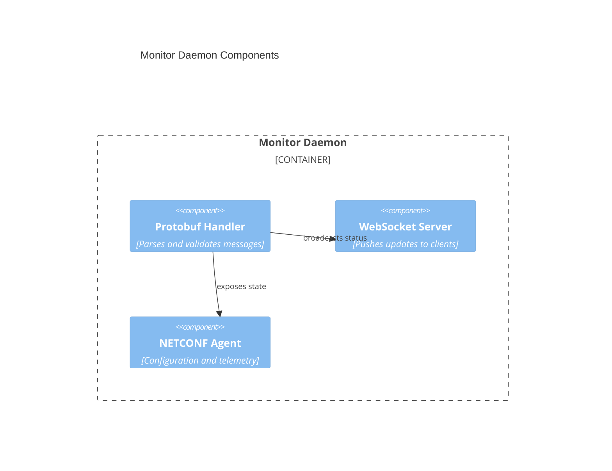

# L-Band Splitter Controller

This directory contains sample C++ code and an Angular component stub for a 32-port L-band splitter/combiner.

The C++ demo computes the center frequency of a synthetic signal using an FFT and stores the result in a `PortState` object.

## Prerequisites

The project uses Conan to provide the required third-party packages such as
Protobuf and Boost.  Install Conan (``pip install conan`` if needed) and let it
detect your host profile:

```
conan profile detect --force
```

## Build and run

Build with the provided `Makefile` to automatically install dependencies and
configure CMake:

```
make build
./build/splitter
```

To run the individual steps manually:

```
conan install . --output-folder build -s build_type=Release --build=missing
cmake -S . -B build -DCMAKE_TOOLCHAIN_FILE=$(find build -name conan_toolchain.cmake -print -quit) -DCMAKE_BUILD_TYPE=Release
cmake --build build --config Release
```

If `cmake` complains about a missing `conan_toolchain.cmake`, ensure the
`conan install` step completed successfully before invoking it.

Run unit tests with CTest:

```
make test
```

Additional handy targets include:

```
make configure  # install dependencies and generate the build system
make run        # build and execute the demo
make clean      # remove the build directory
```

The Angular component (`web/port-status.component.*`) illustrates how a frontend might interact with the backend.

An example Nginx configuration in `web/nginx.conf` shows how to serve the
compiled Angular assets while terminating TLS and proxying `/ws` WebSocket
requests to the daemon running on port 9002.

## Starting dependencies

Use the `start_dependencies.sh` script to build and launch the monitor daemon
and the Angular development server:

```
./start_dependencies.sh
```

The script serves the web UI via `ng serve` at <http://localhost:8080> and starts the daemon
on port 9002. Press `Ctrl+C` to stop both processes.

## STM32 microcontroller implementation

An embedded variant places the FFT and monitoring on an STM32 MCU using the CMSIS-DSP library. Example code in `src/stm32/fft_monitor.cpp` computes the center frequency of a sample buffer and stores it in a shared port table. The main loop in `src/stm32/main.cpp` periodically encodes each port's status and transmits it over UART.

The embedded build forbids C++ exceptions. A standalone CMake project in `src/stm32` builds the MCU code and compiles with `-fno-exceptions`.

## Protobuf protocol and daemon

A lightweight protocol defined in `proto/splitter.proto` allows the microcontroller to send FFT reports or receive commands such as start/stop and enabling or disabling individual ports. Each envelope includes a CRC32 checksum for basic integrity checking. A simple daemon (`monitor_daemon`) parses these protobuf messages on the Linux SBC, verifies the checksum, and prints the results. The daemon also launches a WebSocket server for communication with the Angular frontend and exposes a NETCONF interface for external control and monitoring, enabling remote clients to toggle ports and query their detected center frequencies.

## Architecture

### Context



### Container



### Component (Monitor Daemon)



### Deployment

```mermaid
C4Deployment
    title L-Band Splitter Controller - Deployment
    Deployment_Node(host, "Docker Host", "Linux") {
        Container(nginx, "Nginx")
        Container(webapp, "Web App")
        Container(daemon, "Monitor Daemon")
    }
    Deployment_Node(mcu, "STM32 Microcontroller", "Hardware")
    Rel(daemon, mcu, "TCP protobuf")
```

