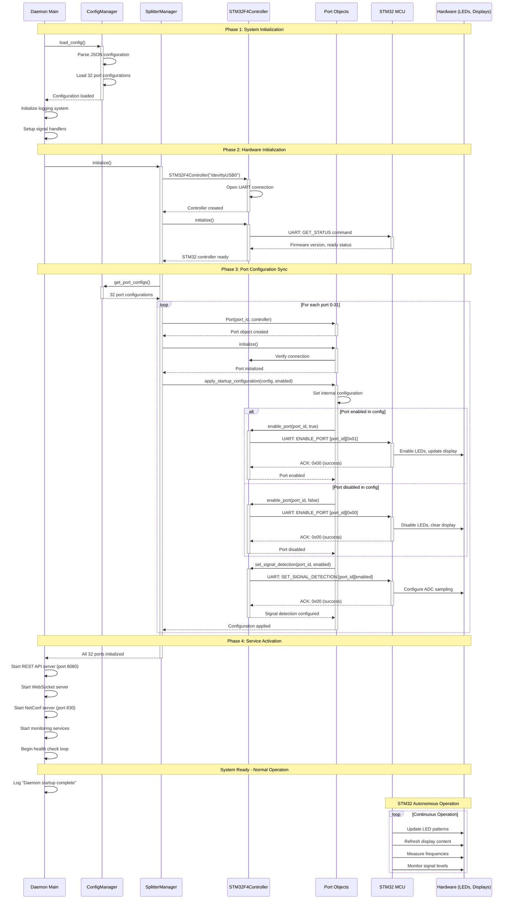

# Daemon Startup Process

This document describes the complete startup sequence of the L-Band Splitter daemon, including configuration loading, STM32 MCU initialization, and port synchronization.

## Overview

The daemon startup process ensures that the STM32 MCU is properly synchronized with the configuration file state, providing consistent system behavior across restarts. The process follows a structured sequence to guarantee reliable initialization.

## Startup Sequence Diagram



## Startup Sequence

### Phase 1: System Initialization

1. **Configuration Loading**
   - Load system configuration from JSON file (default: `/etc/splitter/config.json`)
   - Parse network, logging, and monitoring settings
   - Load port configurations array (32 port objects)
   - Validate configuration integrity

2. **Logging System Setup**
   - Initialize structured logging with spdlog
   - Configure log levels, file rotation, and output destinations
   - Enable debug logging if specified in configuration

3. **Service Registration**
   - Register signal handlers for graceful shutdown
   - Setup systemd integration if running as service
   - Initialize health monitoring endpoints

### Phase 2: Hardware Initialization

4. **STM32F4 Controller Initialization**
   - Open UART connection to `/dev/ttyUSB0` at 115200 baud
   - Perform communication handshake with STM32 MCU
   - Verify firmware version and capabilities
   - Initialize command/response protocol

5. **MCU Health Verification**
   - Send `GET_STATUS` command to verify MCU readiness
   - Check firmware version compatibility
   - Validate hardware abstraction layer availability
   - Confirm I2C multiplexer and display initialization

### Phase 3: Port Configuration Synchronization

6. **Port Object Creation**
   - Create 32 Port objects with references to STM32 controller
   - Initialize each port with basic state tracking
   - Establish port-to-MCU communication channels

7. **Configuration Application** (Critical Phase)
   - For each port (0-31):
     - Load configuration from JSON: `name`, `enabled`, `signal_detection_enabled`
     - Send `ENABLE_PORT` command with port_id to STM32 MCU
     - Configure signal detection settings via `SET_SIGNAL_DETECTION`
     - Verify MCU acknowledgment for each command
     - Update internal port state to match configuration

8. **Hardware State Synchronization**
   - STM32 MCU autonomously updates:
     - LED patterns (solid/blink based on port enabled state)
     - OLED display content (port name and status)
     - I2C multiplexer channel selection
     - ADC sampling configuration for enabled ports

### Phase 4: Service Activation

9. **Network Service Startup**
   - Initialize REST API server on configured port (default: 8080)
   - Start WebSocket server for real-time updates
   - Activate NetConf server on port 830 (if enabled)
   - Enable HTTPS/SSL if configured

10. **Background Services**
    - Start monitoring and metrics collection
    - Begin periodic health checks (every 30 seconds)
    - Initialize continuous frequency measurement thread
    - Activate system event loop

11. **Startup Complete**
    - Log successful initialization with port count
    - Signal systemd service ready (if applicable)
    - Begin normal operational mode

## Configuration File Structure

The daemon reads port configurations from the JSON configuration file:

```json
{
  "network": {
    "rest_host": "127.0.0.1",
    "rest_port": 8080,
    "netconf_host": "0.0.0.0",
    "netconf_port": 830,
    "enable_ssl": false
  },
  "logging": {
    "log_file": "/var/log/splitter/daemon.log",
    "log_level": "info",
    "max_file_size_mb": 100,
    "max_files": 10
  },
  "monitoring": {
    "metrics_interval_seconds": 30,
    "enable_health_endpoint": true
  },
  "ports": [
    {
      "id": 0,
      "name": "Port 1",
      "enabled": false,
      "signal_detection_enabled": true
    },
    {
      "id": 1,
      "name": "GPS L1",
      "enabled": true,
      "signal_detection_enabled": true
    },
    {
      "id": 2,
      "name": "Port 3",
      "enabled": false,
      "signal_detection_enabled": true
    }
  ]
}
```

## UART Command Synchronization

During startup, the daemon sends specific UART commands to synchronize each port:

### Port Enable/Disable Commands
```
Command: ENABLE_PORT (0x03)
Payload: [port_id: uint8_t] [enabled: uint8_t]
Response: [status: uint8_t]

Example:
- Enable port 5: [0x03][0x05][0x01] -> [0x00] (success)
- Disable port 12: [0x03][0x0C][0x00] -> [0x00] (success)
```

### Signal Detection Configuration
```
Command: SET_SIGNAL_DETECTION (0x08)
Payload: [port_id: uint8_t] [enabled: uint8_t]
Response: [status: uint8_t]

Example:
- Enable detection on port 3: [0x08][0x03][0x01] -> [0x00]
```

### Status Verification
```
Command: GET_STATUS (0x05)
Payload: [port_id: uint8_t]
Response: [status: uint8_t] [enabled: uint8_t] [signal_detected: uint8_t]
```

## Error Handling

### Hardware Communication Failures
- **UART Connection Failed**: Daemon logs error and exits with code 1
- **MCU Handshake Timeout**: Retry 3 times before failing
- **Command Acknowledgment Failure**: Log warning but continue (non-critical)
- **Invalid Response**: Reset UART connection and retry

### Configuration Errors
- **Missing Config File**: Create default configuration and continue
- **Invalid Port Configuration**: Use default values and log warning
- **JSON Parse Error**: Exit with detailed error message

### Recovery Procedures
- **Partial Initialization Failure**: Continue with successfully initialized ports
- **STM32 MCU Reset**: Re-synchronize all port configurations
- **Network Service Failure**: Log error but maintain hardware functionality

## Logging During Startup

The startup process generates comprehensive logs for debugging:

```
[INFO] Loading configuration from /etc/splitter/config.json
[INFO] STM32F4Controller initialized on /dev/ttyUSB0
[INFO] Loading configuration for 32 ports
[INFO] Applying startup configuration for port 0: name='Port 1', enabled=false
[INFO] Applying startup configuration for port 1: name='GPS L1', enabled=true
[DEBUG] UART command ENABLE_PORT sent to port 1: success
[DEBUG] Startup configuration applied for port 1
[INFO] SplitterManager initialized successfully with 32 ports
[INFO] REST API server started on 127.0.0.1:8080
[INFO] Daemon startup complete - system ready
```

## Performance Characteristics

### Startup Time
- **Configuration Loading**: ~10ms
- **STM32 Initialization**: ~200ms
- **Port Synchronization**: ~50ms per port (total ~1.6s for 32 ports)
- **Network Services**: ~100ms
- **Total Startup Time**: ~2 seconds

### Resource Usage
- **Memory**: ~15MB resident set size after startup
- **CPU**: <5% during startup, <1% during operation
- **Network**: REST API (8080), NetConf (830), WebSocket connections
- **Hardware**: Single UART interface (/dev/ttyUSB0)

## Troubleshooting Startup Issues

### Common Problems

1. **UART Permission Denied**
   ```bash
   # Add user to dialout group
   sudo usermod -a -G dialout $USER
   # Or run with appropriate permissions
   sudo ./splitter_daemon
   ```

2. **STM32 MCU Not Responding**
   ```bash
   # Check UART device exists
   ls -la /dev/ttyUSB*
   # Test basic communication
   echo "test" > /dev/ttyUSB0
   ```

3. **Configuration File Missing**
   ```bash
   # Create default configuration
   mkdir -p /etc/splitter
   ./splitter_daemon --generate-config > /etc/splitter/config.json
   ```

4. **Port Initialization Failures**
   - Check STM32 firmware version compatibility
   - Verify I2C multiplexer and display hardware
   - Review port configuration validity in JSON file

### Debug Mode Startup
```bash
# Enable debug logging for detailed startup information
./splitter_daemon --log-level=debug

# Or set in configuration file
{
  "logging": {
    "log_level": "debug"
  }
}
```

This comprehensive startup process ensures reliable system initialization and proper synchronization between the daemon configuration and STM32 MCU hardware state.